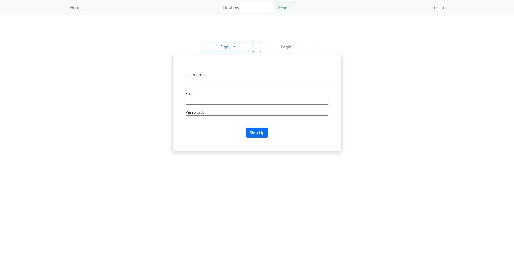

# **Hobby Spot**

## **Table of Contents**

### [App Description](#description)

### [App Usage](#usage)

### [Technologies Used in App](#technologies-used)

### [App Contributors](#contributors)

### [App Links](#links)

## **Description**

### Hobby Spot is a full stack discussion forum application. Users are able to create an account, login, and use those credentials to view and create posts.

## **Usage**

### The usage for this app is to connect with other people who have similar hobbies as you through a forum based community.

## **Technologies Used**

- [bcrypt](https://www.npmjs.com/package/bcrypt)
- [dotenv](https://www.npmjs.com/package/dotenv)
- [express](https://www.npmjs.com/package/express)
- [MySQL2](https://www.npmjs.com/package/mysql2)
- [Sequelize](https://www.npmjs.com/package/sequelize)
- [nodemon](https://www.npmjs.com/package/nodemon)

## **Contributors**

- [Ehren Lewis](https://github.com/Ehren-Lewis)
- [Sarah Thevenot](https://github.com/SThevenot)
- [Vian Charbonneau](https://github.com/vianvianc)
- [Conner Martin](https://github.com/ConnerMart)
- [Carl Sundheim](https://github.com/csundheimjr)
- [Trystan Button](https://github.com/trystan333)

## **Links**

[GitHub Repo](https://github.com/Ehren-Lewis/HobbySpot)  
[Heroku Deploy](https://damp-reaches-02576.herokuapp.com/)

<!-- This is full stack blog application that will focus on:

1. Allowing users to create a login
2.

# 3 databases

1.  schema.sql
    This database is used for initializing information such as blog topics, blog posts
2.  users.sql
    This database is used for login and user authentification
3.  userInfo.sql
    This database is used for storing information about what groups the user has joined, as well as preferences

users.sql

userId: {
type: integer

    probably UUID, it's more secure I think

}

blog posts need a timestamp. This will allow for chronological information presentation

preferences.sql. This could be a through table
or.

User.hasMany(hobbies);
Hobbies.belongsTo(User)

On home page:

SELECT preferences FROM User where User.userName = ${loginUsername}

If this is created dynamically, it may be best to have every databse (OR table)
be a different hobby, it's whatever choice. Probably table

USE DATABASE hobbies;

CREATE TABLE vidoe_games_posts (
psot_numb: INT,
img: img_value (Im not sure how images will work),
user_who_created: VARCHAR(30) (whoever created it),
text_value: string (whatever info they've put),
)

(Every other created table will follow this format essentially)

SELECT TABLE_NAME
FROM INFORMATION_SCHEMA.TABLES
WHERE TABLE_TYPE = 'BASE TABLE' AND TABLE_SCHEMA='dbName'

should get all system table names;

Then:
const som_placeholder = [];
for (i in User.preferences) {
some_placeholder.push(db.query('SELECT \* FROM ${preferences[i]})) (THIS CODE WILL NOT WORK SINCE MYSQL IS ASYNC)
}

then:
sort(someplace_holder by time closest to now);
send data to handlebars.
dynamically render the elements returned;

This should work for the user homepage.
IF you remove the user step and just do SELECT \* FROM url/params/pageName;
You can do link 72 and below for every individual page.

the only delete functionality I think of right now won't be with deleting users.
thats separate url handling to do that

deleting and adding and updating would be through the hobbies people subscribe to;
If doing a put:

First get user.
Then get all user information on preferences.
Since it's a put, append it to current user preference.
Then save

IF delete:
find the preference.name that matches the table name;
delete
save. -->
