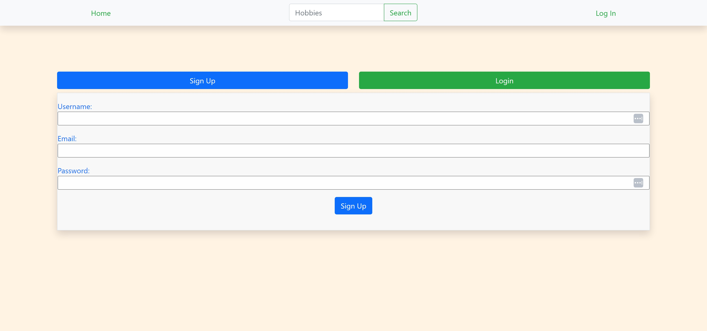
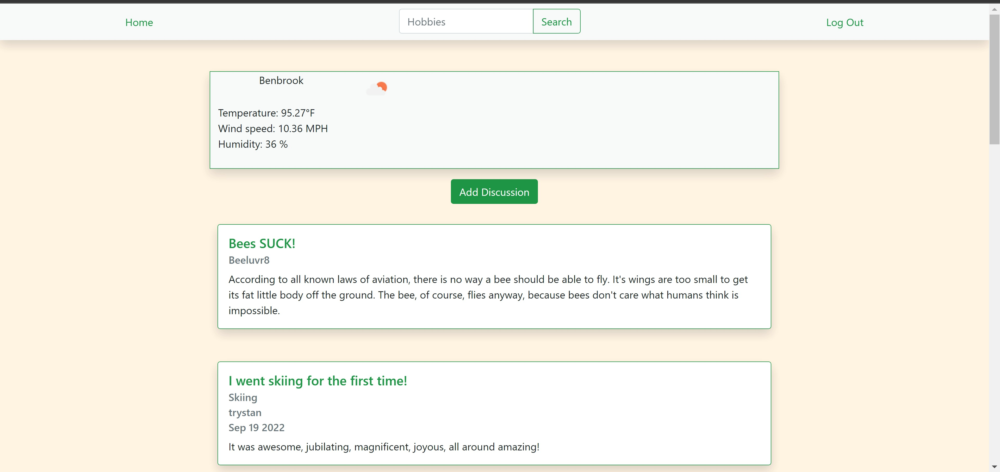
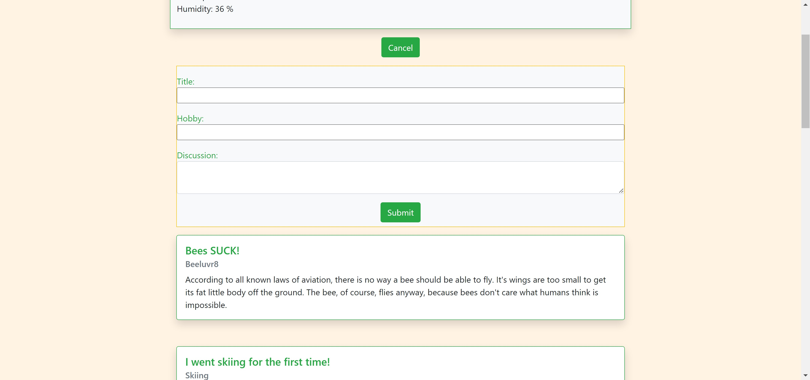

# Hobby Spot

Author: Carl Sundheim Jr., Connor Martin, Ehren Lewis, Sarah Thevenot, Trystan Button, and Vian Charbonneau

## Table Of Contents

* [About This Project](#about-this-project)
* [How to Install](#how-to-install)
* [Usage](#usage)
* [Known Issues](#known-issues)
* [Questions](#questions)
* [License](#license)
* [Contributing](#contributing)

## About This Project

Hobby Spot is a full stack discussion forum application. Users are able to create an account
 and can then log in using their account information to view posts.

Ourmotivation behind this is as individuals who are very diverse in their interests, we all wanted an application that would allow
us to explore different hobbies, as well as share our own with other people.

 Some of the challenges faced during creation was connecting the frontend and backend, making sure the git process flow went smoothly,
 making sure authentification and routes didn't leak any user data, as well as setting up connections between models.

 Future goals for this project include adding a dynamic search bar to allow users to view a page based solely on a single discussion,
 add more authentification on the login system, add a profile page, and to add the ability to comment on posts.
## Technologies Used

[bcrypt](https://www.npmjs.com/package/bcrypt)  
[dotenv](https://www.npmjs.com/package/dotenv)  
[express](https://www.npmjs.com/package/express)  
[MySQL2](https://www.npmjs.com/package/mysql2)  
[Sequelize](https://www.npmjs.com/package/sequelize)  
[nodemon](https://www.npmjs.com/package/nodemon)

## How to Install

    1. Navigate to the code repository
    2. Press the green code button, located near the about section
    3. Copy either the HTTPS, Git CLI, download the zip, open with GitHub desktop, or copy the SSH link.
    4. Depending on download method, use Git, executable, or the desktop application to open the content files.
    5. All of the content of the repository will be available after completion of the previous state.
    
## Links

[GitHub Repo](https://github.com/Ehren-Lewis/HobbySpot)  
 [Heroku Deploy](https://damp-reaches-02576.herokuapp.com/)

## Usage

 To use this project, head over to the deployed link on heroku provided. Create an account or login, then you can view the application and create
 new discussions

 
 
 

## Known Issues

Currently, refreshing the page in the middle of creating a new dicussion will delete it and you would have to start it over again.
The search bar is not fully functional, any searches won't redirect to any page based on input.

## License

MIT License

Copyright (c) 2022 [Ehren Lewis]

Permission is hereby granted, free of charge, to any person obtaining a copy
of this software and associated documentation files (the "Software"), to deal
in the Software without restriction, including without limitation the rights
to use, copy, modify, merge, publish, distribute, sublicense, and/or sell
copies of the Software, and to permit persons to whom the Software is
furnished to do so, subject to the following conditions:

The above copyright notice and this permission notice shall be included in all
copies or substantial portions of the Software.

THE SOFTWARE IS PROVIDED "AS IS", WITHOUT WARRANTY OF ANY KIND, EXPRESS OR
IMPLIED, INCLUDING BUT NOT LIMITED TO THE WARRANTIES OF MERCHANTABILITY,
FITNESS FOR A PARTICULAR PURPOSE AND NONINFRINGEMENT. IN NO EVENT SHALL THE
AUTHORS OR COPYRIGHT HOLDERS BE LIABLE FOR ANY CLAIM, DAMAGES OR OTHER
LIABILITY, WHETHER IN AN ACTION OF CONTRACT, TORT OR OTHERWISE, ARISING FROM,
OUT OF OR IN CONNECTION WITH THE SOFTWARE OR THE USE OR OTHER DEALINGS IN THE
SOFTWARE.

## Contributing

To contribute on this project, contact us through my Github or via email.
